# 🚀 Project 01: Secure Azure VM Network

## 📌 Overview
This project demonstrates how to deploy and secure a Microsoft Azure Virtual Machine using core networking and security services.

The goal was to simulate a real-world cloud environment by implementing:
- Network isolation
- Controlled access
- Secure connectivity

---

## 🛠️ Services Used
- Azure Virtual Machine (Windows Server 2022)
- Virtual Network (VNet)
- Subnet
- Network Security Group (NSG)
- Azure Storage Account

---

## 🏗️ Architecture Diagram
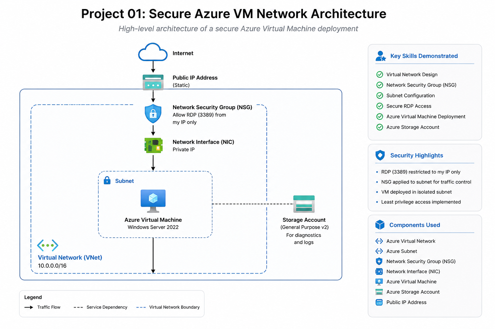

---

## ⚙️ Deployment Steps

### 1. Environment Initialization
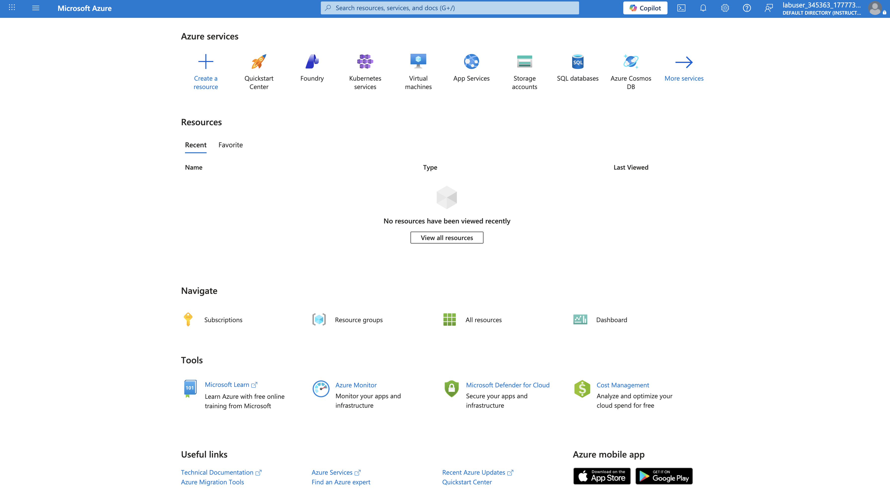

---

### 2. Resource Group Setup
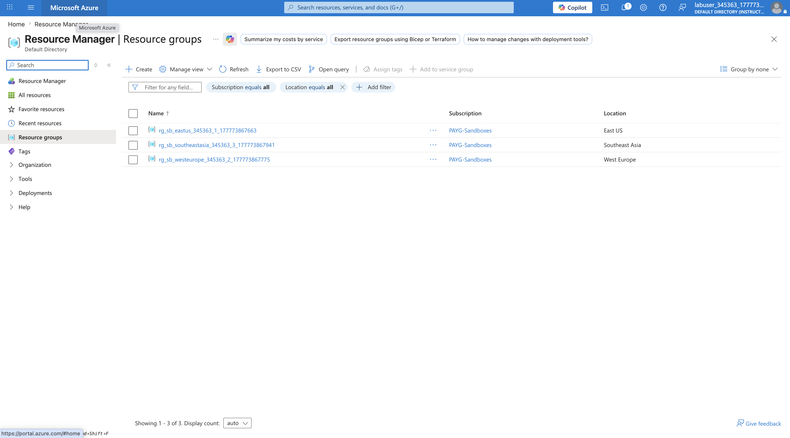
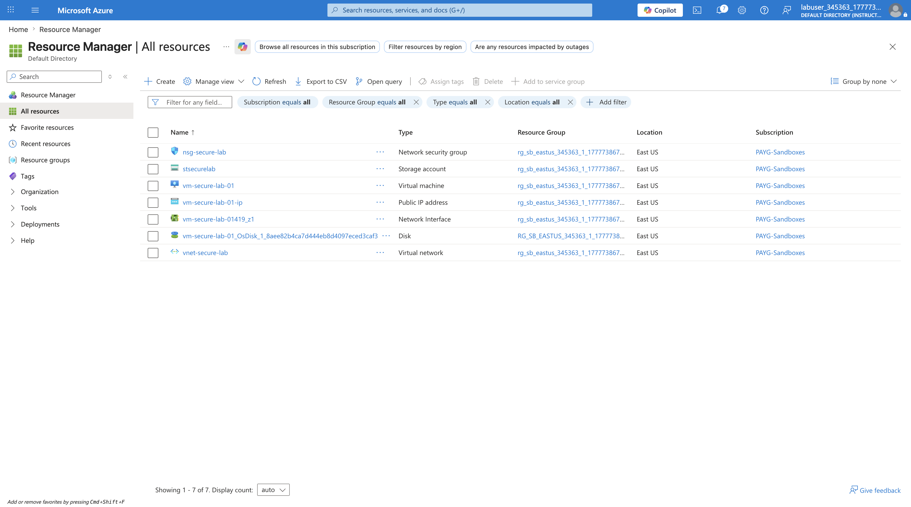

---

### 3. Virtual Network & Subnet Configuration
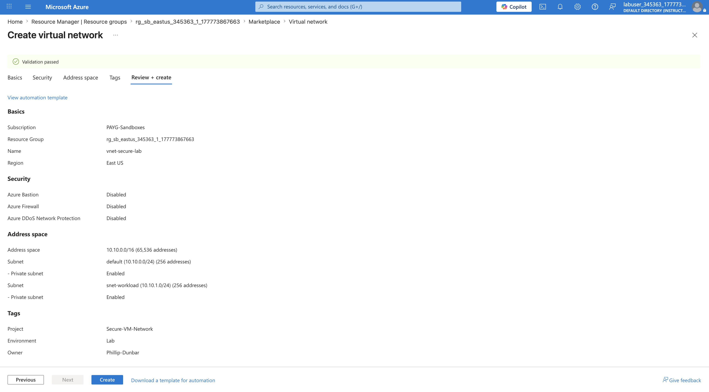
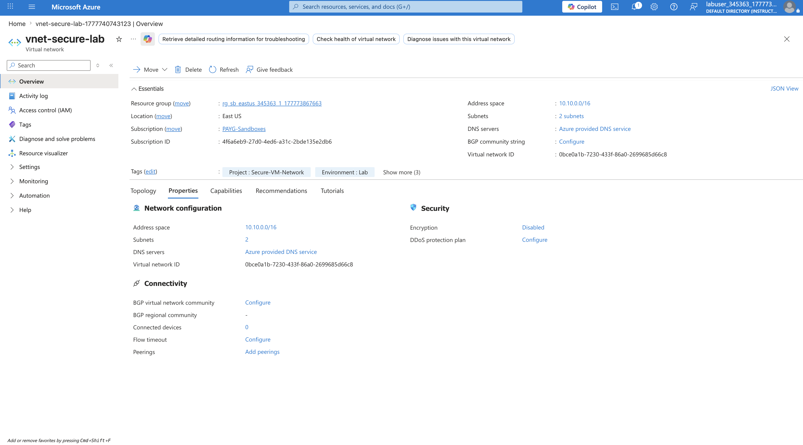

---

### 4. Network Security Group (NSG)
Configured inbound rules to allow secure RDP access only.

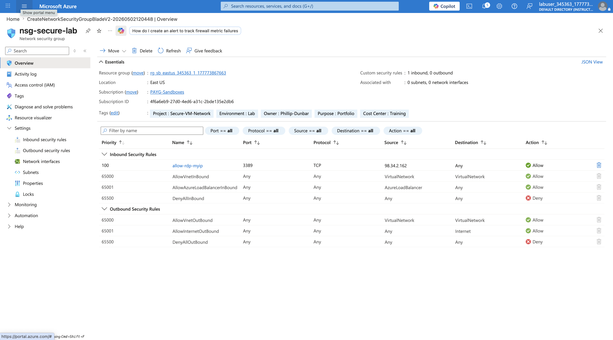
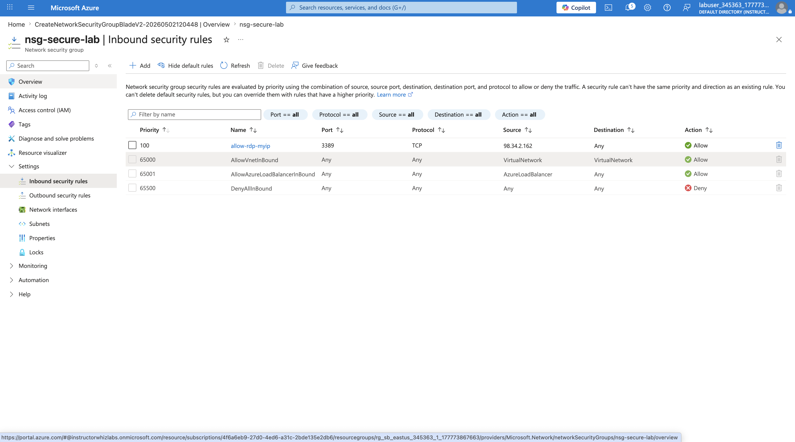

---

### 5. Virtual Machine Deployment
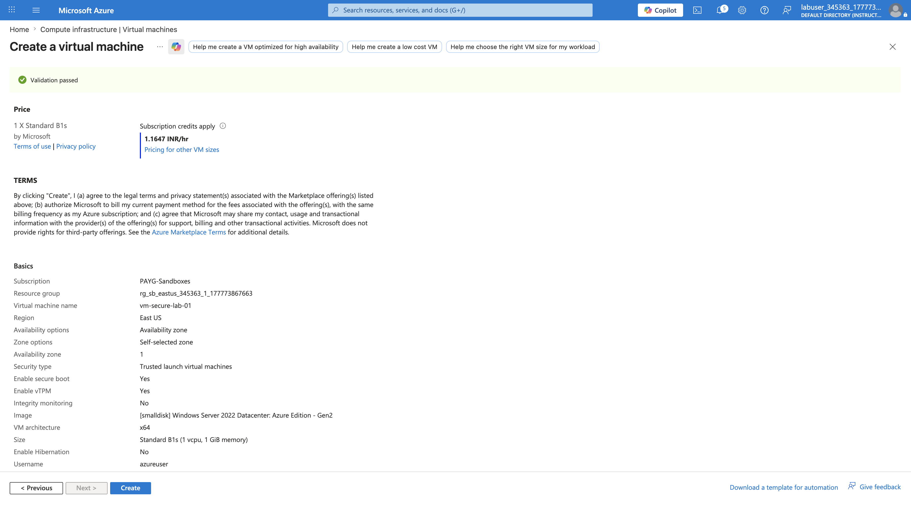
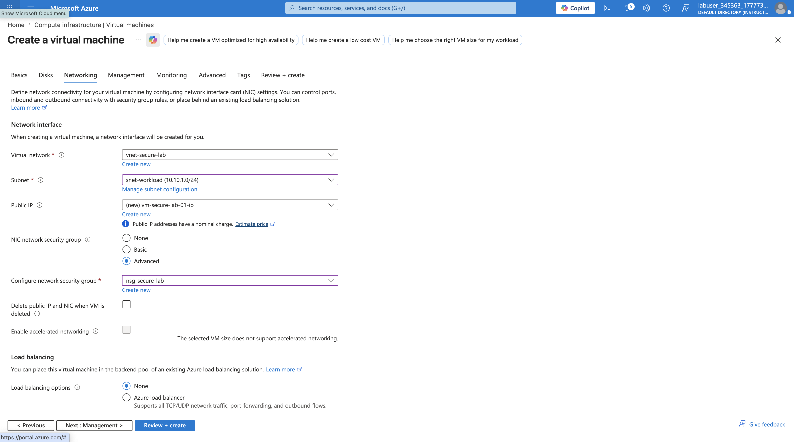

---

### 6. VM Validation & Connectivity
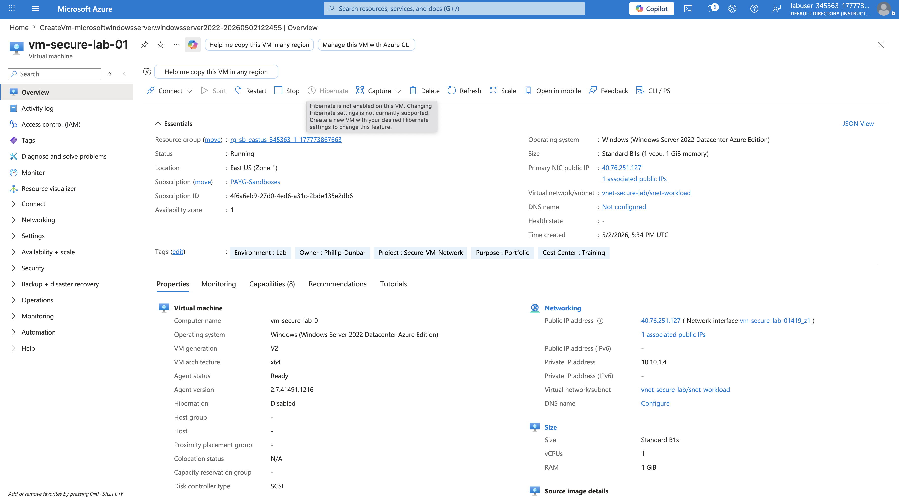
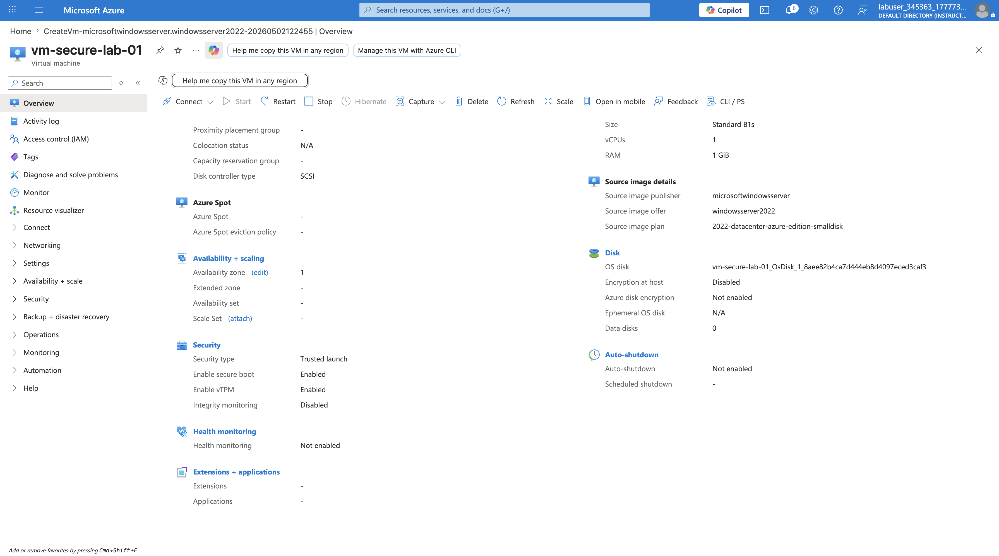

---

### 7. Storage Account Configuration
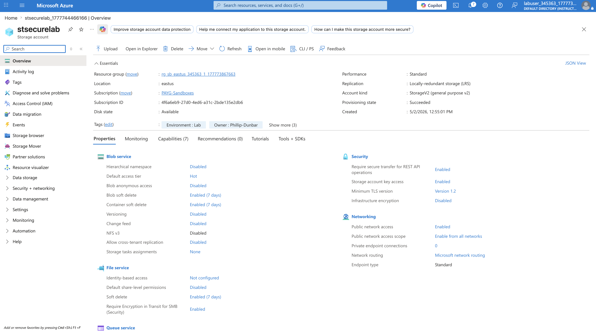

---

## 🔐 Security Implementation
- Restricted RDP (Port 3389) to specific IP
- Applied Network Security Group rules
- Isolated VM within subnet
- Controlled inbound traffic

---

## 📚 What I Learned
- How Azure networking components work together (VNet, Subnets, NSGs)
- How to securely expose a VM to the internet
- How to troubleshoot VM deployment and connectivity
- How to structure real-world cloud environments

---

## 🎯 Outcome
Successfully deployed a secure Azure VM environment with controlled access and documented the full process for reproducibility.

---

## 📌 Next Improvements
- Implement Azure Bastion (remove public RDP exposure)
- Add Azure Monitor for logging
- Automate deployment using ARM/Bicep templates
